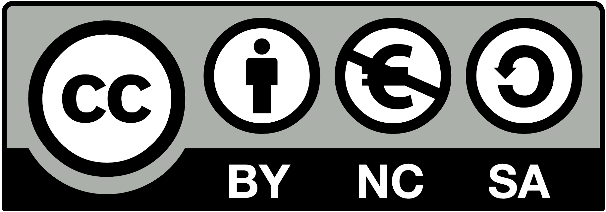

# Szablon pracy dyplomowej

**[Przykład PDF](versions/PracaDyplomowa-LAST.pdf)**

Strona tytułowa bazująca na [szablonie][wefimszablon] dla wefim 2022.

Minimalny szablon zawierający tylko stronę tytułową zostawiłem na [branch'u titlePage (tutaj)](https://github.com/goorkamateusz/praca-dyplomowa-szablon/tree/titlePage).

## Autorzy
Górka Mateusz, [@goorkamateusz](https://goorkamateusz.github.io)

Szablon bazujący na szablonach Tomasza Kubika oraz Adama Ratajczaka z dawnego wydziału elektroniki.

- dr inż. Tomasz Kubik\
 [Strona internetowa](http://tomasz.kubik.staff.iiar.pwr.wroc.pl/)
- dr inż. Adam Ratajczak\
[Strona internetowa](http://diablo.iiar.pwr.edu.pl/~ar/LaTeX/mgr.php)

## Life hacks

### Wykorzystywane wtyczki do Visual Studio Code

- [LaTeX](https://marketplace.visualstudio.com/items?itemName=mathematic.vscode-latex)\
_Ogromnie przydatne narzędzie do sprawdzania poprawności ortograficznej, składniowej i gramatycznej._
- [LaTeX Utilities](https://marketplace.visualstudio.com/items?itemName=tecosaur.latex-utilities)
- [LaTeX Workshop](https://marketplace.visualstudio.com/items?itemName=James-Yu.latex-workshop)
- [ToDo Tree](https://marketplace.visualstudio.com/items?itemName=Gruntfuggly.todo-tree)
- [Better Comments](https://marketplace.visualstudio.com/items?itemName=aaron-bond.better-comments)

W pliku `.vscode/settings.json` pozostawiłem przydatne konfiguracje edytora i wtyczek.

### Bash - twój przyjaciel automatyzacji
Zapisywanie kolejnych wersji w plikach pdf.

```sh
git tag x.y.z
. save.sh
```

## Licencja

Szablon jest udostępniany na licencji Creative Commons: Uznanie autorstwa - Użycie niekomercyjne - Na tych samych warunkach, 3.0 Polska, Wrocław 2022.
Oznacza to, że wszystkie zawarte nim treści można kopiować i  wykorzystywać do celów niekomercyjnych, a także tworzyć na ich podstawie utwory zależne pod warunkiem podania autora i nazwy licencjodawcy oraz udzielania na utwory zależne takiej samej licencji. Tekst licencji jest dostępny pod adresem: [Creative Commons 3.0](http://creativecommons.org/licenses/by-nc-sa/3.0/pl/).



Edycja i rozpowszechnianie szablonu wymaga podania wszystkich autorów, najlepiej wraz z odnośnikami do miejsca w których szablon jest udostępniany.

Przy wykorzystaniu szablonu w pracy dyplomowej nie jest wymagane podawanie autora szablonu.

[wefimszablon]: https://view.officeapps.live.com/op/view.aspx?src=https%3A%2F%2Fwefim.pwr.edu.pl%2Ffcp%2FFGBUKOQtTKlQhbx08SlkDUg1eUTgtCgg9ACFDC1RDS2FBWxslAxt1FSVcViU%2F219%2Fpublic%2F2021%2Fdocs%2Fdyplomanci%2F08112021%2Fwzor_strony_tytulowej_inz_12.doc&wdOrigin=BROWSELINK&fbclid=IwAR3QWe-6gLxgH4UJTaxIHrGUU6fu77SGT4IZecImWhOfkByDa_ubz0pB0GA
